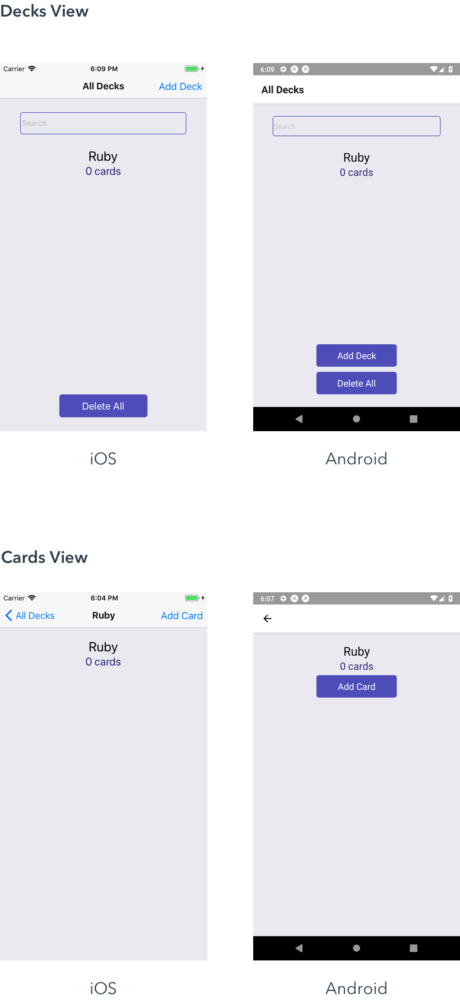

# React Native Project - Mobile Flashcards

This repo contains submission of the React Native project for Udacity React Nanodegree.

This app was built from [Create React Native App](https://github.com/react-community/create-react-native-app).

This app has been tested on Android (API level 28) and iOS (Version 11.4).

# Getting Started

## Install
Optional. If you have NVM installed, then `nvm use`.
- `yarn` or `npm install`

## Run

### Android
- `npm run android` or `yarn run android`.

### iOS
- `npm run ios` or `yarn run ios`.

# Design Considerations

## Cross Platform Differences

- On iOS, the Add Buttons are a part of the navigation.
- On Android, the Add Buttons are a part of the main view.

See the following screenshots for illustration: 

## Extra Features

These additions outside of the rubric.

- The Delete All button deletes all decks and cards.
- The Deck Filter allows one to search for a deck by its title. 
